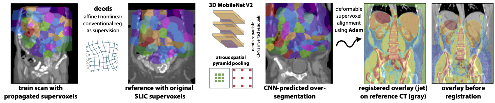
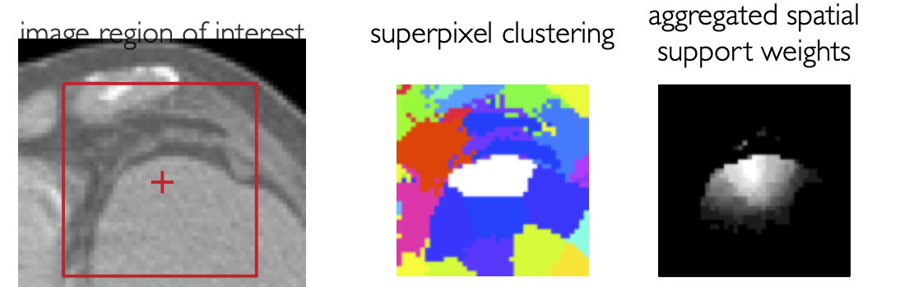

# slic_reg
Rethinking the Design of Learning based Inter-Patient Registration using Deformable Supervoxels (MIDL 2021)
https://openreview.net/forum?id=zZA5TpNdC4Z



This repository provides open source code for our SLIC_Reg approach for 3D deformable image registration.
The dataset used in this paper is a pre-processed version of the "Beyond the Cranial Vault" MICCAI challenge on abomdinal CT and contains manual segmentations of the following 13 anatomies right kidney, left kidney, gallbladder, esophagus, liver, stomach, aorta, inferior vena cava, portal vein, pancreas, right adrenal gland, left adrenal gland. It contains 30 public scans that were split into training (#2,3,5,6,8,9,21,22,24,25,27,28,30,31,33,34,36,37,39,40) and validation (#1,4,7,10,23,26,29,32,35,38) out of which #38 was selected as template. The data can be obtained here: https://cloud.imi.uni-luebeck.de/s/c9GapHY3cx9x82p (648 MBytes)
Please cite: http://discovery.ucl.ac.uk/1501854/1/Modat_TBME-01460-2015.R2-preprint.pdf if you use this data and register at https://www.synapse.org/#!Synapse:syn3193805/wiki/89480 for the original access.
## 0) Pre-Processing
The original scans were resampled to isotropic 2mm resolution using c3d (c3d img/img0002.nii.gz -resample-mm 2x2x2mm) and cropped to our target shape 192x160x256 as follows. A centre of mass was computed from the following weight tensor (using Houndsfield units):
```
 weight = torch.sigmoid(10-10*torch.abs((data-0)/250*2-1)).unsqueeze(0).unsqueeze(0)
 weight2 = -F.max_pool3d(-weight,3,stride=1,padding=1).squeeze(0)
 centre = torch.sum(xyz*weight2,[1,2,3])/(0.0001+torch.sum(weight2,[1,2,3]))
```
From this an affine_grid to transform the scan and segmentation can be directly obtained.

Our **SLIC_REG** method comprises the following steps:
## 1) Template Registration
A single template scan is selected (as fixed scane) from which both linear and deformable transformations are estimated to all training images without any supervision. 
For this step we employ both linear and nonlinear registration of the deeds algorithm: https://github.com/mattiaspaul/deedsBCV with default parameters, e.g.
```
./linearBCV -F Training/img/img0002.nii.gz -M Training/img/img0038.nii.gz -O baseline/F02_38
./deedsBCV -F Training/img/img0002.nii.gz -M Training/img/img0038.nii.gz -A baseline/F02_38_matrix.txt -O baseline/F02_38
```
 This results in 20 affine matrices and 20 nonlinear displacement fields (e.g. baseline/F02_38_displacements.dat).
To read in those displacements and convert the values to a pytorch grid_sample compatible format use:
```
with open('baseline/F02_38_displacements.dat', 'rb') as content_file:
        content = content_file.read()
grid_space = int((torch.pow(torch.Tensor([H*W*D])/(len(content)/12),0.334)))
with torch.no_grad():
    disp_field = torch.from_numpy(np.array(struct.unpack('f'*(len(content)//4),content))).reshape(1,3,D//grid_space,W//grid_space,H//grid_space).cuda().permute(0,1,4,3,2).float()
    disp_field = F.interpolate(disp_field,size=(H,W,D),mode='trilinear',align_corners=None).permute(0,2,3,4,1)[:,:,:,:,torch.Tensor([2,0,1]).long()].flip(4)
    disp_torch = disp_field.flip(4)/torch.Tensor([256-1,160-1,192-1]).cuda().view(1,1,1,1,3)*2
```


## 2) SLIC supervoxel over-segmentation
The template scan is automatically over segmented using the SLIC supervoxel algorithm with subsequent post-processing to obtain an equal number (here 127 + background) of connected supervoxels within a rough body mask. A single 3D oversegmentation is obtained using the skimage toolkit for SLIC:
```
cluster = skimage.segmentation.slic(img_aff[i,0].cpu().numpy(),multichannel=False,mask=sdt_aff[i,0].cpu().numpy()<30,\
                                   compactness=1.5, enforce_connectivity=True, max_iter=5, n_segments=208, min_size_factor=0.85)
```
Here, img_aff is the reference scan transformed with a random affine matrix and sdt_aff the signed distance transform of its corresponding foreground mask (by choosing <30 this is dilated by 30 voxels or 60 mm ensuring that nearly the whole body is registered). 

This step is repeated 16 times with slightly varying initialisations so that each voxel can be identified by a 16-tuple of supervoxels (please also see (Heinrich et al., 2013) for details http://www.mpheinrich.de/pub/IPMI2013_mycopy.pdf). By simultaneously assigning each voxel to multiple layers of supervoxels its spatial position in the canonical space of reference coordinates is more accurately defined as outlined in the sketch below:


Unfortunately, the number of superpixels returned by skimage.segmentation is not always equal to n_segments. Hence, we implemented a post-processing that iteratively merges smaller segments until 127 foreground and one background supervoxels are reached (see code for details).

Next, the reference supervoxels are spatially transferred to all training images using deeds’ displacement fields. 

## 3) 3D DeepLab prediction of SLIC segmentation 
Third, a deep CNN is trained to densely predict the over-segmentations for unseen images (see Fig. 1 for a qualitative result). We designed a compact 3D DeepLab (MobileNetV2 with ASPP) (Sandler et al., 2018) for best performance on a small dataset. That means for each voxel a total of 16 softmax scores (with 128 class probabilities) is estimated and one-to-one correspondences between reference and test image could be directly obtained. Yet, to obtain an optimal displacement field that balances the potentially diverging correspondences and avoids erroneous hard assignments, we implement another step that optimises the alignment of all supervoxels using the Adam optimiser with a di↵usion regularisation penalty (details are found in source code).
